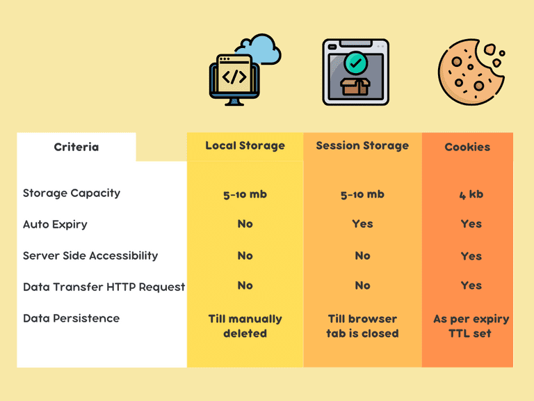

## JSON
   - stringify
   - parse

# Browser Storage 

  ```setItem```
  ```getItem```
  ```removeItem```
  ```clear```


## LocalStorage
  - max size is 5 mb.!
  - period of storage is infinite.!

## SessionStorage
  - max size 100 bytes.!
  - period of storeage is tab

## Cookies
  - max size is 4mb
  - period of storage in infinite
  - cookies can be used in the backend

<br> <br> <br> 

